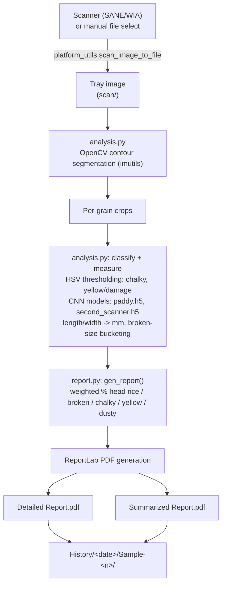

# National Grain Tech (NGT) — Rice Grain Quality Analysis

A desktop application that grades a scanned tray of rice grains automatically. It segments the individual grains from a scanned image, classifies defects (chalky, yellow/damaged, dusty, broken) with a mix of classical image processing and trained CNN models, computes per-grain measurements, and generates PDF quality reports.

## What It Does

1. **Capture** — Pulls an image either from a connected scanner (via a `platform_utils` scan helper) or a manually selected file, through a Tkinter GUI.
2. **Segment** — Uses OpenCV contour detection (`imutils`) to isolate each individual grain from the tray image.
3. **Classify & Measure** — For every grain, `analysis.py`:
   - Measures grain length/width and converts pixel distances to millimeters.
   - Detects **chalkiness** and **yellow/damage** discoloration using HSV color thresholding.
   - Classifies grain condition (e.g. **paddy**, **dusty**, **broken**) using pretrained Keras/TensorFlow CNN models.
   - Buckets broken grains into long/medium/small categories against configurable thresholds.
4. **Report** — `report.py` aggregates the per-grain results into weighted percentages (head rice vs. broken, chalky %, yellow/damage %, dusty %) and renders a **Detailed Report** and a **Summarized Report** as PDFs (via ReportLab), pulling in sample metadata (sample #, date, party name, vehicle #, rice type, moisture, visual "look" rating) entered by the operator.
5. **Archive** — Each run's reports and processed images are saved under `History/<date>/Sample-<n>/`.

## Architecture



Plain-text fallback:

```
Scanner (SANE/WIA) or manual file select
            |
            v
   Tray image (scan/)
            |
            v
   analysis.py: OpenCV contour segmentation (imutils)
            |
            v
   Per-grain crops
            |
            v
   analysis.py: classify + measure
   - HSV thresholding: chalky, yellow/damage
   - CNN models: paddy.h5, second_scanner.h5
   - length/width -> mm, broken-size bucketing
            |
            v
   report.py: gen_report()
   weighted % head rice / broken / chalky / yellow / dusty
            |
            v
   ReportLab PDF generation
            |
      +-----+-----+
      v           v
Detailed       Summarized
Report.pdf     Report.pdf
      |           |
      +-----+-----+
            v
   History/<date>/Sample-<n>/
```

`main.py` drives this as a GUI event loop: it wires the Tkinter buttons (scan/browse, run analysis, view report) to `analysis.py` and `report.py`, and handles image preview, progress state, and error dialogs.

## Project Structure

```
main.py               Tkinter GUI, application entry point and event handling
analysis.py            Image segmentation, grain measurement, defect classification
report.py              PDF report generation (Detailed + Summarized reports)
platform_utils.py      Cross-platform helpers (scanner access, screen size, icons, screenshots)
setup.py               cx_Freeze build config (legacy Windows packaging)
main.spec              PyInstaller build config
MyApp.bat              Windows launcher (activates venv, runs main.py)
History/               Per-run output: <date>/Sample-<n>/{Detailed,Summarized} Report.pdf + images
```

## Requirements

The GUI and image pipeline depend on:

- Python 3.x with `tkinter`
- `opencv-python` (`cv2`)
- `numpy`, `pandas`, `scipy`
- `tensorflow` + `keras`
- `scikit-learn`
- `imutils`
- `Pillow` (`PIL`)
- `matplotlib`
- `reportlab`, `python-bidi`, `textwrap3` (PDF report generation with RTL text support)
- `pyautogui` (non-Windows screenshots)
- `python-sane` (Linux scanner access) / `pywin32` (Windows scanner + `.ico` support)

## Running It

```bash
# Windows
call venv\Scripts\activate.bat
python main.py
# or just double-click MyApp.bat

# Linux / macOS
source .venv/bin/activate
python main.py
```

A pre-built Windows executable (`National Grain Tech NGT.exe`) is also included, built via `main.spec` (PyInstaller) or `setup.py` (cx_Freeze).

## Platform Notes

The codebase was originally Windows-only (WIA scanner API, `.ico` icons, hardcoded `D:\`/`E:\` drive checks used as a license/dongle gate). It's since been adapted for cross-platform use:

- Scanner access, screen-size detection, and screenshots are now routed through `platform_utils.py`, which branches on `platform.system()` — using `pywin32`/WIA on Windows and `python-sane`/`pyautogui` on Linux.
- The old hardcoded drive-letter and expiration-date checks in `main.py` have been bypassed so the app runs outside the original locked environment.
- Tkinter icon loading is now wrapped in a try/except so missing `.ico` files don't crash the app on Linux.
